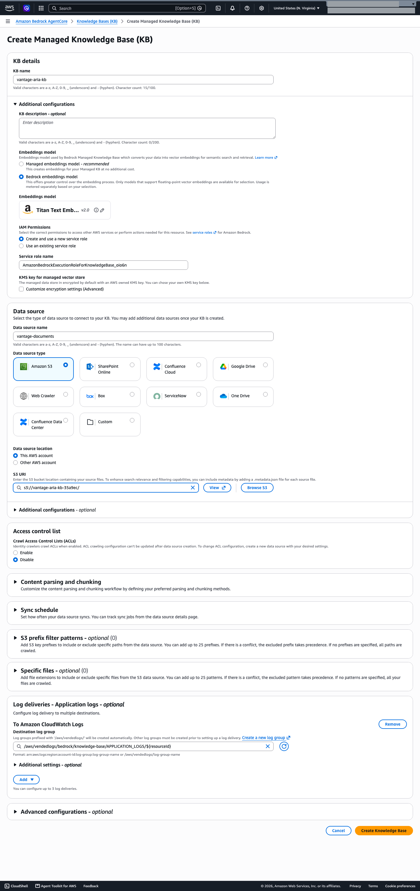
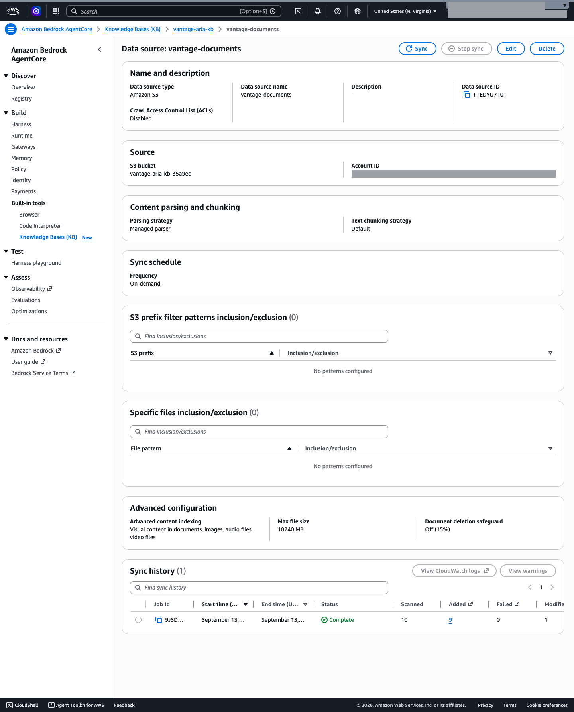
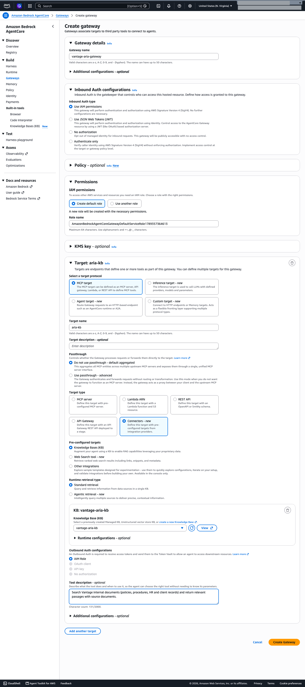
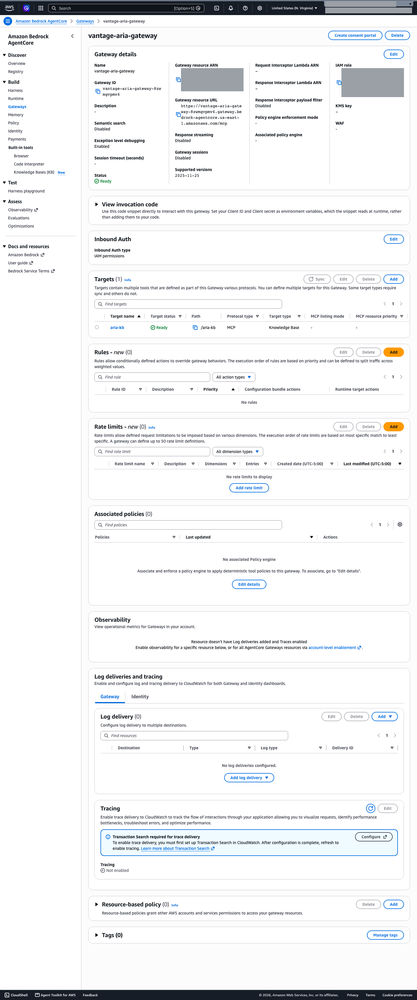
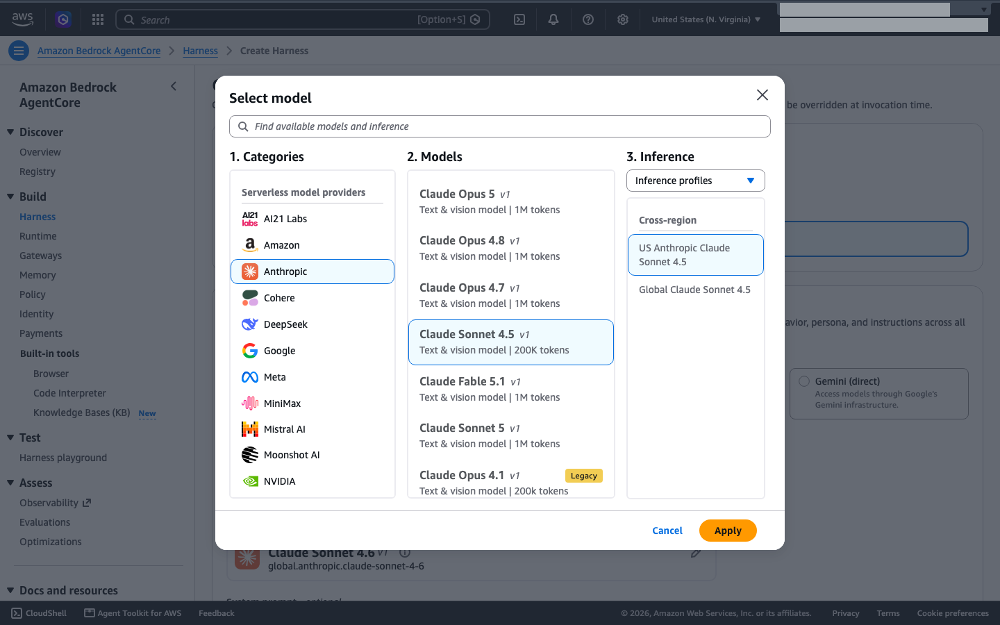
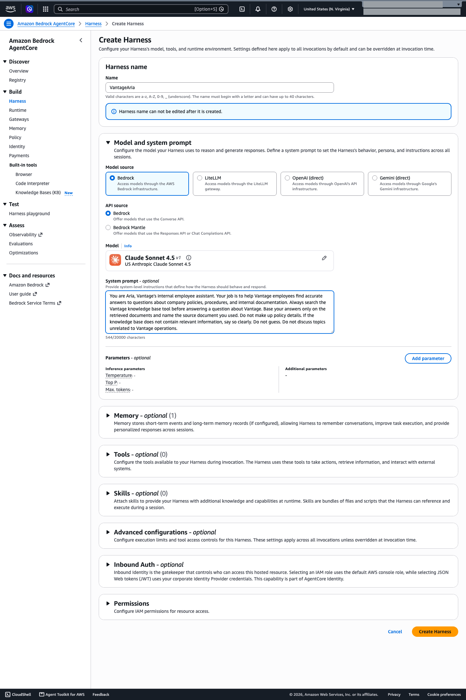
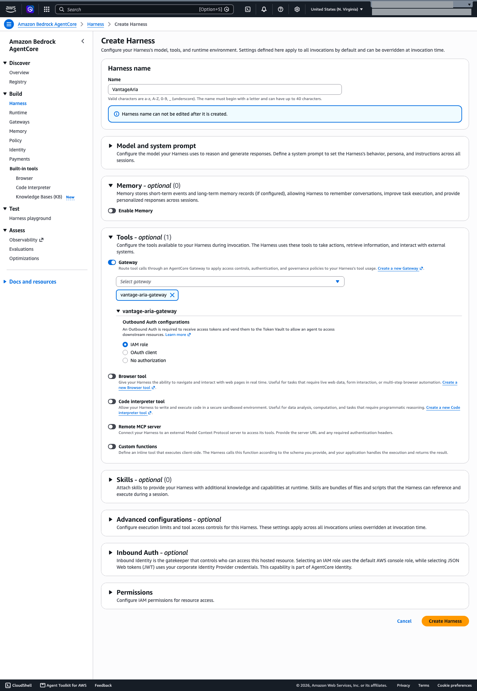
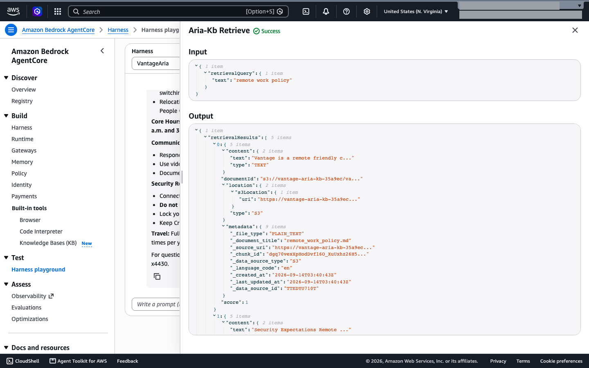

# Build Aria: Demonstration Environment Setup

**Do this walkthrough before any `DEMO.md` or numbered exercise.** In it you build **Aria**, the internal employee assistant of **Vantage Technologies**. Every `DEMO.md` in this course uses Aria as its demonstration system. The same steps are on the **Build Aria: Set Up the Demo Environment** page in Lesson 1 of the classroom.

The capstone project has you build a different assistant, **Northstar Assist**, on the same architecture. Building Aria here gives you practice with every console step you'll repeat in the project.

**Estimated time:** about 2 hours the first time, plus a few minutes for the knowledge base sync. The guardrail step takes the longest.

**Prerequisites**

- A Udacity Cloud Lab. Sign in to the AWS Console from the **Cloud Resources** tab.
- Region **US East (N. Virginia) us-east-1**. Check that the region selector shows **United States (N. Virginia)** before each step.
- The `vantage-aria-knowledge-base/` folder, which sits next to this walkthrough.
- You don't need to request model access. Models are available the first time you use them.

> **Console defaults.** Several AWS console forms default to settings that are different from the ones this walkthrough uses. Each step names the setting to choose. When a form shows a section this walkthrough doesn't mention, leave it at its default.

---

## What you'll build

```
Employee ─▶ Harness (VantageAria) ─▶ Gateway tool ─▶ AgentCore Gateway ─▶ Managed Knowledge Base ─▶ S3 documents

Created here, attached by a later demo: Bedrock guardrail (aria-production-guardrails)
Always on: model invocation logging to CloudWatch Logs
```

| Resource | Name | What it does |
|---|---|---|
| S3 bucket | `vantage-aria-kb-<unique-suffix>` | Stores the Vantage documents, with versioning on |
| Managed Knowledge Base | `vantage-aria-kb` | Chunks and embeds the documents (Titan Text Embeddings V2) and runs retrieval |
| AgentCore Gateway | `vantage-aria-gateway` | Exposes the knowledge base to the harness as a `Retrieve` tool (target `aria-kb`) |
| Harness | `VantageAria` | The agent: model, system prompt, and the gateway tool |
| Guardrail | `aria-production-guardrails` | Content, prompt attack, denied topic, PII, and grounding filters. Not attached yet |
| Invocation logging | `/aws/bedrock/vantage-aria/invocations` | Records every model call |

A **harness** is a managed agent. You choose a model, write a system prompt, and attach tools, and AWS runs the agent loop for you.

> A harness can't attach a knowledge base directly. The knowledge base reaches the harness as a tool on an AgentCore Gateway. That extra hop is a trust boundary, and you'll see it again in the threat modeling demos.

---

## Step 1: Create the S3 bucket and upload the documents

1. Search for **S3** in the console search bar and open it.
2. Choose **Create bucket**. Leave **General purpose** and **Global namespace** selected.
3. Enter **Bucket name** `vantage-aria-kb-<unique-suffix>`, for example your initials plus a few digits. Bucket names must be globally unique. Don't put personal information in the name.
4. Under **Bucket Versioning**, choose **Enable**. The knowledge base poisoning demo rolls a document back to an earlier version, so versioning has to be on from the start.
5. Leave the other settings at their defaults (**Block all public access** stays on) and choose **Create bucket**.
6. Open the bucket and choose **Upload** → **Add folder**. Select the `vantage-aria-knowledge-base` folder.

   The folder name becomes a key prefix, so objects are stored as `vantage-aria-knowledge-base/remote_work_policy.md` and so on. That's fine; the knowledge base reads the whole bucket.

7. Choose **Upload**. Confirm the summary shows **10 files** succeeded and **0** failed.

---

## Step 2: Create the Managed Knowledge Base

A Managed Knowledge Base runs the vector store for you. There's no OpenSearch collection or S3 Vectors bucket to create, and nothing billed by the hour.

1. Search for **Amazon Bedrock AgentCore** and open it. In the left navigation under **Built-in tools**, choose **Knowledge Bases (KB)**, then **Create Managed KB**.
2. Under **KB details**, enter **KB name** `vantage-aria-kb`.
3. Expand **Additional configurations**:
   - Under **Embeddings model**, choose **Bedrock embeddings model**. The form's default is **Managed embeddings model**. Choose the Bedrock option so you know exactly which embeddings model the knowledge base uses; the ML-BOM demo records it. **Titan Text Embeddings V2** is selected by default. Keep it.
   - Under **IAM Permissions**, keep **Create and use a new service role**.
   - Leave the other sections (encryption, parsing and chunking, sync schedule, and so on) at their defaults.
4. Under **Data source**:
   - **Data source name:** `vantage-documents`
   - Keep **Amazon S3** and **This AWS account**.
   - **S3 URI:** `s3://<your-bucket-name>/` (or choose **Browse S3** and select the bucket).

   

5. Choose **Create Knowledge Base**. Creation takes 2–5 minutes.

   **Stay on this page until the console opens the knowledge base details page.** The console creates the data source and turns on log delivery in follow-up calls from this page. If you leave early, the knowledge base can end up with no data source.

6. When **Status** is **Available**, check the **Data source** section:
   - If it shows **Data source (0)**, choose **Add**, add the `vantage-documents` data source with the settings from step 4, and then sync it.
   - The first sync can start on its own. If **Sync** is unavailable, a sync is already running. Otherwise, select the `vantage-documents` data source and choose **Sync**.
7. Wait for the sync to finish. The knowledge base shows a **Last sync time**, and no documents should fail.

   

> Note the **Service role** name on this page (`AmazonBedrockExecutionRoleForKnowledgeBase_…`) and the knowledge base ID. The console also turns on application log delivery to `/aws/vendedlogs/bedrock/knowledge-base/APPLICATION_LOGS/<kb-id>`. Check that **Log delivery** lists one entry. If it's empty, choose **Log delivery** → **Add log delivery** → **To Amazon CloudWatch Logs**, keep the prefilled path, and choose **Add**. The ML-BOM and monitoring demos use these.

---

## Step 3: Create the AgentCore Gateway with a knowledge base target

The **Create Gateway** form defaults to settings you need to change. The inbound auth default is **JWT** with **Quick create with Cognito**, the target type default is **MCP server**, and the outbound auth default is **OAuth client**. Change all three as described below.

1. In **Amazon Bedrock AgentCore**, choose **Gateways** → **Create Gateway**.
2. Enter **Gateway name** `vantage-aria-gateway`.
3. Under **Inbound Auth configurations**, choose **Use IAM permissions**.
4. Under **Permissions**, keep **Create default role**.
5. In the **Target** section:
   - **Target name:** `aria-kb`
   - **Select a target protocol:** **MCP target**
   - **Target type:** **Connectors**, then under **Pre-configured targets** choose **Knowledge Bases (KB)**
   - **Runtime retrieval type:** **Standard retrieval**
   - **Knowledge Base (KB):** select `vantage-aria-kb`
   - **Outbound Auth configurations:** **IAM Role**
   - **Tool description:** `Search Vantage internal documents (policies, procedures, HR and client records) and return relevant passages with source documents.` A clear description helps the model pick the tool.

   

6. Choose **Create Gateway**. Wait until the gateway **Status** is **Ready** and the `aria-kb` target is also **Ready**. The target takes about 30 seconds longer than the gateway.

   

---

## Step 4: Create the harness

1. In **Amazon Bedrock AgentCore**, choose **Harness**. On the harnesses table, open the dropdown next to **Quick create Harness** and choose **Advanced create Harness**. Quick create skips settings you need.
2. **Harness name:** `VantageAria`. Only letters, numbers, and underscores are allowed (no hyphens), and you can't change the name later.
3. Expand **Model and system prompt**:
   - **Model source:** **Bedrock**. **API source:** **Bedrock**.
   - **Model:** the form's default is **Claude Sonnet 4.6** with a **Global** inference profile. Change it: choose the pencil icon, then **Anthropic** → **Claude Sonnet 4.5**. Under **3. Inference**, choose the **US** cross-Region profile (**US Anthropic Claude Sonnet 4.5**), not **Global**. Then choose **Apply**. The ML-BOM, monitoring, and IAM demos all assume the US profile (`us.anthropic.claude-sonnet-4-5-20250929-v1:0`). Claude Haiku 4.5 and Amazon Nova 2 Lite also work. The demo results in this course were recorded with Claude Sonnet 4.5, so other models can give different answers.

     

     > **Don't use Amazon Nova Lite (v1) or Nova Pro (v1).** In testing, both failed on every knowledge base question with `Model produced invalid sequence as part of ToolUse`. Claude 3.7 Sonnet is retired and can't be invoked.

   - **System prompt:**

     ```
     You are Aria, Vantage's internal employee assistant. Your job is to help Vantage employees find accurate answers to questions about company policies, procedures, and internal documentation. Always search the Vantage knowledge base tool before answering a question about Vantage. Base your answers only on the retrieved documents and name the source document you used. Do not make up policy details. If the knowledge base does not contain relevant information, say so clearly. Do not guess. Do not discuss topics unrelated to Vantage operations.
     ```

   - Leave **Parameters** empty. Don't attach a guardrail now; the input sanitization demo compares Aria's behavior before and after the guardrail.

   

4. Expand **Memory** and turn **Enable Memory** off. Memory is on by default. Cross-session memory adds cost and the demos don't need it.
5. Expand **Tools**, turn on **Gateway**, choose **Select gateway** → `vantage-aria-gateway`, and keep **Outbound Auth configurations** set to **IAM role**. Leave **Browser tool**, **Code interpreter tool**, **Remote MCP server**, and **Custom functions** off.

   

6. Expand **Permissions** and keep **Create default role**. Leave **Skills**, **Advanced configurations**, and **Inbound Auth** at their defaults.
7. Choose **Create Harness**. The harness and its **DEFAULT** endpoint are ready in about a minute. A banner asks you to make sure the IAM execution role has the required permissions. That banner is expected; the default role works for this walkthrough.

   

8. Copy the **Harness ARN** and note the **IAM role** name (`AmazonBedrockAgentCoreHarnessDefaultServiceRole-…`). Later demos use both.

---

## Step 5: Test the baseline in the Harness playground

1. In the left navigation under **Test**, choose **Harness playground**. At the top of the page, select the `VantageAria` harness and its **DEFAULT** endpoint. Leave **Session ID** empty.
2. In **Write a prompt**, enter the following and press **Enter** (or choose the send arrow):

   ```
   What is Vantage's remote work policy? Name the source document.
   ```

   Leave the playground's **System prompt** box empty. Text in that box replaces the harness system prompt for that run.

3. Check the response:
   - It shows an **Agent trace** with an **Aria-Kb Retrieve** tool call, followed by the answer.
   - The answer names `remote_work_policy.md` as its source.
4. Select the tool call. You see the exact query the model sent and the retrieved chunks, with document title, S3 location, and relevance score. This is exactly what lands in the model's context window, and several demos rely on this view.

   

If the trace has no tool step, see [Troubleshooting](#troubleshooting).

---

## Step 6: Create the guardrail (don't attach it yet)

You create the guardrail now so it's ready when a demo needs it. The input sanitization demo attaches it and compares Aria's answers with and without it.

The **Create guardrail** wizard has eight pages: guardrail details, content filters, denied topics, word filters, sensitive information filters, contextual grounding check, Automated Reasoning check, and review. This is the longest step in the walkthrough.

1. Search for **Amazon Bedrock**, open it, and in the left navigation choose **Guardrails** → **Create guardrail**.
2. **Provide guardrail details:**
   - **Name:** `aria-production-guardrails`
   - **Description:** `Guardrails for the Vantage Aria agent`
   - **Messaging for blocked prompts:** `Sorry, Vantage Aria can't answer this question.`
   - Turn on **Apply the same blocked message for responses** (it's on by default).
   - Leave the **Cross-Region inference** and KMS key settings at their defaults.
3. **Configure content filters:**
   - Turn on **Configure harmful categories filters**. Turning it on sets every category to **Block** at **High** for both prompts and responses. Change **Insults** to **Medium**. Keep **Hate**, **Violence**, **Sexual**, and **Misconduct** at **High**.
   - The threshold is a slider. Drag the slider or use the arrow keys. Selecting the **Medium** label doesn't move it, so check where the slider stopped.
   - Keep the **Classic** content filters tier (the default). The **Standard** tier requires cross-Region inference.
   - Turn on **Configure prompt attacks filter** and set it to **High**.
4. **Add denied topics.** Choose **Add denied topic** for each of these four topics. In each dialog, keep **Input** and **Output** enabled with the **Block** action (the defaults), enter the definition, and add the sample phrases under **Add sample phrases** (type a phrase, then choose **Add phrase**). On the Classic tier a definition can be at most 200 characters, and each sample phrase at most 100 characters.

   | Name | Definition | Sample phrases |
   |---|---|---|
   | `employee-compensation-data` | Any query requesting specific salary figures, compensation ranges, pay bands, bonus structures, or equity grants for individual employees or employee groups. | "tell me salaries" / "what do engineers make" / "compensation for role X" |
   | `employee-pii-beyond-directory` | Any request to retrieve or compile personal data about named employees beyond name and corporate contact information. | "give me Jane's home address" / "what is Smith's SSN" |
   | `internal-security-architecture` | Any query requesting details about Vantage's specific vulnerability posture, penetration test findings, or infrastructure configuration weaknesses. | "what are Vantage's security gaps" / "describe the AWS architecture weaknesses" |
   | `competitor-pricing` | Questions about the pricing, discounts, or commercial terms of competitor products. | "how much does FakeCo charge for this product" / "tell me about the pricing of our competitor for this product" |

   Check that all four topics show status **Valid**.

5. Skip **word filters**. A later demo adds one in version 2.
6. **Add sensitive information filters.** Choose **Add new PII** for each type. Each dialog has separate **Input** and **Output** sections, and both default to **Block**. For **Phone** and **Email**, change **both** the Input action and the Output action to **Mask**.

   | PII type | Input action | Output action |
   |---|---|---|
   | **US Social Security Number (SSN)** | **Block** | **Block** |
   | **Credit/Debit card number** | **Block** | **Block** |
   | **AWS secret key** | **Block** | **Block** |
   | **Phone** | **Mask** | **Mask** |
   | **Email** | **Mask** | **Mask** |

   **Mask** in the console is `ANONYMIZE` in the API, and **Detect** is `NONE`.

7. **Add contextual grounding check:** turn on **Enable grounding check** and **Enable relevance check**. Both thresholds default to **0.7**; keep them.

   > A contextual grounding check scores whether a response is supported by the retrieved source and relevant to the question. It doesn't detect instructions inside retrieved documents. In testing on harness traffic, the guardrail recorded no grounding assessment, so don't rely on this check to protect Aria.

8. Skip the **Automated Reasoning check** page.
9. On the review page, check the summary (Insults Medium, the other categories High, 4 denied topics, 5 PII types, grounding and relevance 0.7), then choose **Create guardrail**.
10. On the guardrail page, choose **Create version**, then **Create**. You now have **version 1**.
11. Copy the **guardrail ARN** (`arn:aws:bedrock:us-east-1:<account-id>:guardrail/<guardrail-id>`). The next section uses it.

### Attaching the guardrail (used by later demos)

Don't do this now. When a demo tells you to attach the guardrail, follow these steps.

> **Required:** the console's default harness role does **not** include `bedrock:ApplyGuardrail`. If you attach the guardrail without adding this permission, every request fails with `AccessDeniedException … not authorized to perform: bedrock:ApplyGuardrail`.

1. On the `VantageAria` harness details page, choose the **IAM role** link (`AmazonBedrockAgentCoreHarnessDefaultServiceRole-…`).
2. Choose **Add permissions** → **Create inline policy**, switch the editor to **JSON**, and paste the following with your guardrail ARN:

   ```json
   {
     "Version": "2012-10-17",
     "Statement": [
       {
         "Sid": "ApplyAriaGuardrail",
         "Effect": "Allow",
         "Action": "bedrock:ApplyGuardrail",
         "Resource": "arn:aws:bedrock:us-east-1:<account-id>:guardrail/<guardrail-id>"
       }
     ]
   }
   ```

3. Choose **Next**, name the policy `VantageAriaApplyGuardrail`, and choose **Create policy**.
4. In **Amazon Bedrock AgentCore** → **Harness**, choose `VantageAria` to open its details page, then choose **Edit**. (The **Edit** button on the harness list stays unavailable until you select a harness.)
5. In **Model and system prompt** → **Parameters**, choose **Add parameter** (it reads **Edit parameter** if a parameter already exists). The panel that opens already has one empty row under **Additional parameters**. Fill in that row instead of adding another:
   - **Parameter:** `guardrailConfig`
   - **Value:** `{"guardrailIdentifier":"<guardrail-arn>","guardrailVersion":"1","trace":"enabled"}`

   Don't put the JSON in the **Inference parameters** fields (Temperature, Top P, Max tokens).
6. Choose **Save** in the panel. This only stages the change. If the panel stays open, a field has an invalid value; fix it before you continue.
7. At the bottom of the **Edit Harness** page, choose **Save Harness**. If you skip this, the guardrail isn't applied. The harness now sends the guardrail with every model request.

> The guardrail checks the model's input and output on each request. **Retrieved chunks don't pass through it before they reach the model**, so an injection hidden in a document isn't screened as user input. The knowledge base poisoning demo explores this gap.

---

## Step 7: Turn on model invocation logging

Create the log group before you turn on logging. The role that Bedrock creates for logging can write to an existing log group, but it can't create one. If the log group doesn't exist, saving the settings fails with **Failed to validate permissions for log group**.

1. Search for **CloudWatch** and open it. In the left navigation, choose **Logs** → **Log groups** → **Create log group**.
2. **Log group name:** `/aws/bedrock/vantage-aria/invocations`. Leave the other settings at their defaults and choose **Create**.
3. Search for **Amazon Bedrock**, open it, and choose **Settings** in the left navigation.
4. Turn on **Model invocation logging**.
5. Under **Select the data types to include with logs**, all four types (**Text**, **Image**, **Embedding**, **Video**) are selected by default. Clear **Image**, **Embedding**, and **Video**, and keep **Text** selected.
6. Under **Select the logging destinations**, choose **CloudWatch Logs only**.
7. **Log group name:** `/aws/bedrock/vantage-aria/invocations`. If you've used this form before, it may still show an earlier log group. Replace it.
8. Under service access, choose **Create default role**, and enter **Role name** `VantageAriaInvocationLoggingRole`. The role name is required.
9. Choose **Save settings**. The page shows **Your settings have been saved successfully**. If saving fails, the form resets; see [Troubleshooting](#troubleshooting).
10. Reopen **Settings** and check that the log group is `/aws/bedrock/vantage-aria/invocations` and the role is `VantageAriaInvocationLoggingRole`.

What you'll find in CloudWatch after you use Aria:

| Source | Location | What it shows |
|---|---|---|
| Model invocation logs | `/aws/bedrock/vantage-aria/invocations` | Harness calls appear as `ConverseStream` entries. Their `identity.arn` is the harness execution role (`…/AmazonBedrockAgentCoreHarnessDefaultServiceRole-…/BedrockAgentCore-<session>`). Knowledge base embedding calls appear under the knowledge base service role |
| Harness runtime logs | `/aws/bedrock-agentcore/runtimes/harness_VantageAria-<id>-DEFAULT` | Harness runtime activity |
| Knowledge base application logs | `/aws/vendedlogs/bedrock/knowledge-base/APPLICATION_LOGS/<kb-id>` | Ingestion and sync events |

> Model invocation logging is an account-wide setting. Every model call in the account and Region is logged to this log group, including calls from the capstone project if you build it in the same account.

> CloudWatch **Transaction Search**, which the GenAI Observability trace dashboards need, can't be enabled with Udacity Cloud Lab permissions. The monitoring demos use the log sources above.

---

## Step 8 (optional): Call Aria from Python

Some demos run Python code or AWS CLI commands against your lab account. Set up the connection once per lab session.

1. From the repository root, install the Python packages. The harness API needs boto3 1.43.52 or later.

   ```bash
   pip install -r requirements.txt
   ```

2. Open `aws-credentials.txt` in the repository root.
   - From the **Cloud Resources** tab, copy the **AWS Access Key ID**, **AWS Secret Access Key**, and **AWS Session Token**, and paste them into the file.
   - After `Harness ARN =`, paste the **Harness ARN** from the `VantageAria` harness details page.
   - Save the file.

3. From the repository root, run the setup script:

   ```bash
   python setup_aws.py
   ```

   The script checks your credentials with AWS and sets up the terminal for the demos. Then it clears the keys from `aws-credentials.txt`, so they don't stay in your course files. Your harness ARN stays in the file. You don't need to edit any other file.

   Open a new terminal before you run demo code, or run `source .env` in the current one.

4. Ask Aria a question:

   ```bash
   python skill-pair-00-bedrock-setup/ask_aria.py
   ```

   Follow-up questions share one harness session. Type `/new` to start a new session and `/quit` to stop. Every question is billed.

Cloud Lab credentials expire when the lab session ends. If a script reports missing or expired credentials, start the lab again, paste the new credentials into `aws-credentials.txt`, and rerun `python setup_aws.py`. To see which identity is saved, run `python setup_aws.py --check`.

At its core, `ask_aria.py` makes one `invoke_harness` call:

```python
import os
import uuid

import boto3

client = boto3.client("bedrock-agentcore", region_name="us-east-1")

response = client.invoke_harness(
    harnessArn=os.environ["AGENTCORE_HARNESS_ARN"],
    runtimeSessionId=str(uuid.uuid4()),  # must be at least 33 characters; a UUID is 36
    messages=[{"role": "user", "content": [{"text": "What is Vantage's remote work policy?"}]}],
)

answer = ""
for event in response["stream"]:
    if "contentBlockDelta" in event:
        delta = event["contentBlockDelta"]["delta"]
        if "text" in delta:
            answer += delta["text"]

print(answer)
```

The harness streams every model turn, including text before and after the tool call, so collect all text deltas.

---

## Cost notes

- A Managed Knowledge Base has no hourly vector store charge.
- You pay for usage: model tokens for each harness request, embedding tokens when you sync, and knowledge base retrieval requests.
- Memory is off, so there's no memory storage cost.
- CloudWatch Logs charges for ingestion and storage are small at demo volumes.

## Clean up

**Keep this stack running while you work through the demos.** Each `DEMO.md` assumes Aria exists. Clean up when you finish the course, or rebuild with this walkthrough if your lab resets.

Delete resources in this order. Each delete dialog asks you to type a confirmation word, and the word differs between resources (for example `delete`, `Delete`, `permanently delete`, or the bucket name). Type exactly what the dialog shows.

1. **Harness:** AgentCore → **Harness** → select `VantageAria` → **Delete**
2. **Gateway:** AgentCore → **Gateways** → `vantage-aria-gateway`. Delete the `aria-kb` target first, then delete the gateway
3. **Knowledge base:** AgentCore → **Knowledge Bases (KB)** → choose `vantage-aria-kb` to open its details page → **Delete**. Deletion can take several minutes
4. **Guardrail:** Amazon Bedrock → **Guardrails** → `aria-production-guardrails` → **Delete**
5. **S3 buckets:** S3 → select your knowledge base bucket → **Empty**, then **Delete**. With versioning on, **Empty** also removes old object versions. If you created the access log bucket in the knowledge base poisoning demo (`vantage-aria-access-logs-<suffix>`), empty and delete it too
6. **Model invocation logging:** Amazon Bedrock → **Settings** → turn it **off**. This setting is account-wide, so turn it off only when nothing else in the account needs it
7. **CloudWatch:** delete the log groups (`/aws/bedrock/vantage-aria/invocations`, the `VantageAria` harness runtime log group, and the knowledge base application log group), plus any metric filters, alarms (such as `VantageAria-HighInvocationVolume`), and dashboards you created
8. **SNS:** delete any topics you created for alarms (such as `vantage-aria-security-alerts`)
9. **IAM Access Analyzer:** delete `vantage-aria-analyzer` if you created it
10. **IAM:** delete the roles the console created (`AmazonBedrockAgentCoreHarnessDefaultServiceRole-…`, `AmazonBedrockAgentCoreGatewayDefaultServiceRole…`, `AmazonBedrockExecutionRoleForKnowledgeBase_…`, and `VantageAriaInvocationLoggingRole`). Also delete the customer managed policies the console created for them under **Policies** (their paths start with `service-role/`). Inline policies you added, such as `VantageAriaApplyGuardrail`, are deleted with their role

## Troubleshooting

| Symptom | Cause | Fix |
|---|---|---|
| `AccessDeniedException … bedrock:ApplyGuardrail` on every request | Guardrail attached, but the harness role lacks the permission | Add the inline policy in [Attaching the guardrail](#attaching-the-guardrail-used-by-later-demos) |
| `Model produced invalid sequence as part of ToolUse` | Nova Lite v1 or Nova Pro v1 selected | Edit the harness and switch to Claude Sonnet 4.5, Claude Haiku 4.5, or Nova 2 Lite |
| Answers don't mention any document and the trace has no tool step | Gateway not attached, `aria-kb` target not Ready, or knowledge base not synced | Recheck Step 2.7, Step 3.6, and Step 4.5 |
| Knowledge base is **Available** but shows **Data source (0)** | You left the create page before the console added the data source | In the knowledge base's **Data source** section, choose **Add**, add `vantage-documents`, and sync |
| Gateway target stuck or Failed | The knowledge base isn't a **Managed** KB | The gateway knowledge base connector supports only Managed Knowledge Bases |
| Upload shows fewer than 10 files | Files were selected individually or the upload was interrupted | Upload the whole `vantage-aria-knowledge-base` folder with **Add folder**, then sync again |
| Harness name rejected | Name contains hyphens or other symbols | Use `VantageAria` (letters, numbers, and underscores only) |
| **Save** in the harness parameter panel does nothing, and **Save Harness** can't be selected | A panel field has an invalid value, such as JSON in **Temperature** | Clear the inference parameter fields, put the JSON in the **Additional parameters** row, and choose **Save** again |
| Python call fails with `ValidationException` about the session ID | Session ID too short | Use a session ID of at least 33 characters, such as `str(uuid.uuid4())` |
| Saving invocation logging settings fails with **Failed to validate permissions for log group** | The log group doesn't exist yet. The logging role can't create it | Create `/aws/bedrock/vantage-aria/invocations` in CloudWatch Logs (Step 7.1), then fill in the Bedrock settings form again and save. The form resets after a failed save |
| Invocation logs go to a different log group than expected | The settings form kept a log group from an earlier save | In Bedrock **Settings**, replace the log group name, check the role, and save again |
