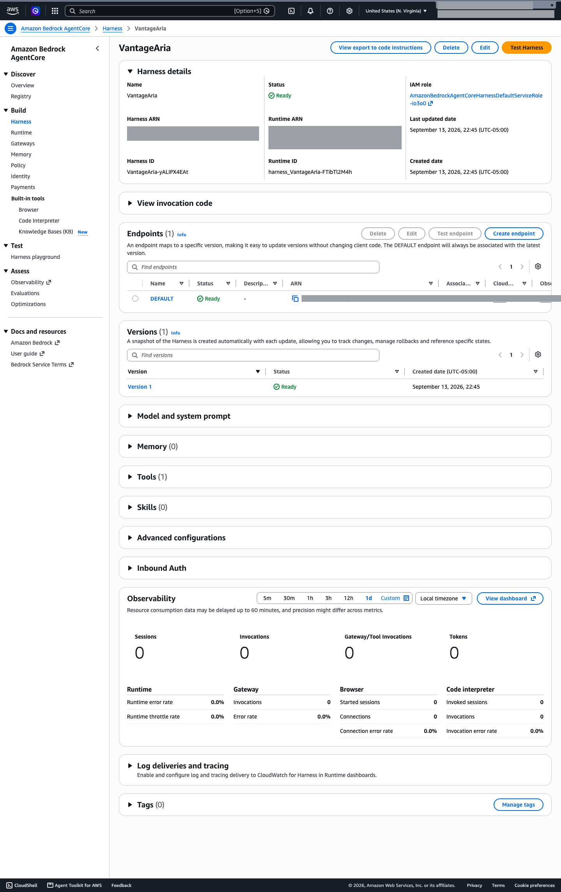
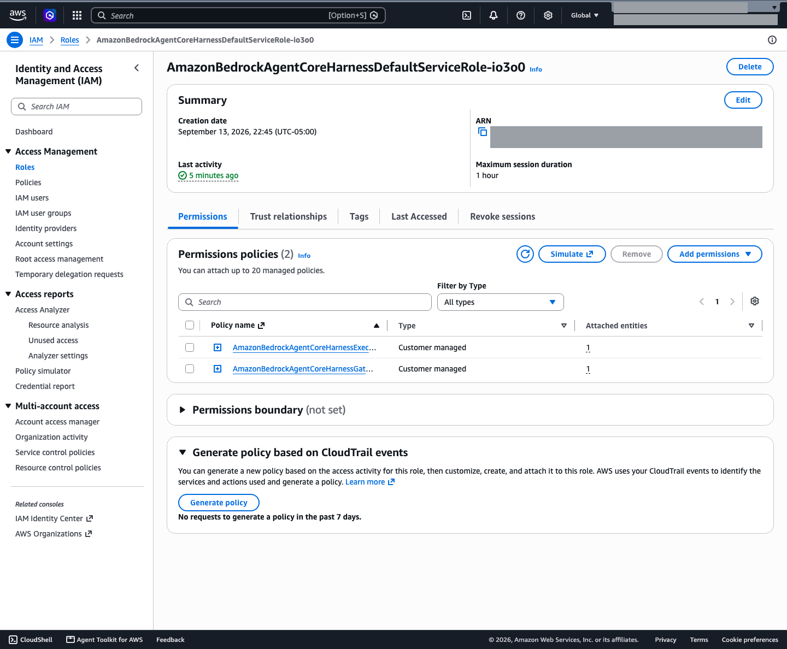

# Demo: Securing an AI Model Serving Endpoint

**Estimated Time:** 10 minutes

---

> **Note:** This demo uses **Aria**, the internal assistant of **Vantage Technologies**, running on an Amazon Bedrock AgentCore harness (see `skill-pair-00-bedrock-setup/WALKTHROUGH.md`). It shows the concept in a live environment before you apply it to the scenario in `EXERCISE.md`. At this point in the course, the guardrail is version 1 and isn't attached. Lesson 11 attaches it.

## Overview

This demo shows what an AI endpoint looks like with no security controls, and what it looks like once they're in place. You walk through Aria's configuration, find what was left wide open, and lock it down.

Secure model serving on a managed platform isn't about firewall rules and ports. It's about IAM policies, logging, and how the application handles credentials. A harness adds one more thing: the role the harness runs as.

---

## Scenario

Vantage Technologies runs Aria on a harness. It works, and users can query it, but the configuration is wide open:

- Nothing limits which models can be used. The harness runs under the console's default role, which allows every foundation model.
- Model invocation logging is off, so there's no audit trail.
- The application hardcodes AWS credentials in source code.
- The application's IAM policy grants `bedrock:*` on `*`.

---

## Tools

- AWS Console (Amazon Bedrock AgentCore, Amazon Bedrock, IAM)
- AWS CLI
- Python with boto3 (`boto3>=1.43.52`)

---

## Key Insights

**IAM authentication vs. content-level controls**
IAM answers "who is allowed to call this API." Content-level controls (input length limits, output validation, guardrails) answer "what inputs and outputs are allowed." You need both. A valid IAM principal can still send malicious or runaway prompts.

**Two identities on a harness**
The app's caller policy decides who can reach Aria. The harness execution role decides what Aria can reach, including which models it can run. Scope both.

**A harness guardrail is a default, not a control**
A caller can pass a per-request `model` override. An override without guardrail settings runs with no guardrail. Only the harness role's IAM policy can make the guardrail mandatory.

**Model invocation logging is an audit trail and a sensitive data store**
Harness calls are logged as `ConverseStream` records. They hold full prompts, the system prompt, retrieved chunk text, and answers the guardrail blocked. Turn logging on, then restrict who can read it.

**Managed endpoint vs. self-hosted model serving**
With a self-hosted model (on EC2 or EKS), you own the network endpoint: TLS certificates, VPC exposure, security groups, and the inference server. With a managed service the endpoint belongs to AWS. The only access path is the API, so IAM is the control plane.

**HTTPS is guaranteed, but the payload still matters**
The SDK always uses HTTPS. What you do need to think about is what's inside the payload and where it ends up, including the logs.

**How the app authenticates**
Use IAM roles, not static access keys. On AWS compute (EC2, ECS, Lambda), the attached role provides temporary credentials, and boto3 picks them up with no credential code.

---

## Demo Steps

### Step 1 — Find the real model gate

Amazon Bedrock has no model access step. Models are available on first use, so IAM (plus any SCPs above the account) is the only gate on which models can be called.

Open **Amazon Bedrock AgentCore > Harness > VantageAria** and choose the **IAM role** link. The console's default role, `AmazonBedrockAgentCoreHarnessDefaultServiceRole-<suffix>`, has two customer managed policies. Its execution policy allows:

- `bedrock:InvokeModel*` on `foundation-model/*` and on `arn:aws:bedrock:us-east-1:<acct>:*`
- AgentCore Browser and Code Interpreter sessions, EFS and S3 Files mounts, and Memory events, even though Aria uses none of them
- `bedrock-mantle` inference actions (`CreateInference` and `CallWithBearerToken` on `*`) and `ecr` image pulls, which Aria also doesn't use

Open the role's **Last Accessed** tab. After a round of test prompts it showed 11 services granted and only 5 used (`bedrock`, `bedrock-agentcore`, `ecr-public`, `logs`, `xray`). You fix this role in Step 6.



### Step 2 — Model invocation logging

If you followed the **Build Aria: Set Up the Demo Environment** page in Lesson 1, logging is already on. Check it in the Bedrock console under **Settings > Model invocation logging**, and skip the command.

To turn it on yourself, create the log group first. The role that Bedrock creates for logging can write to an existing log group, but it can't create one. In CloudWatch, choose **Logs > Log groups > Create log group**, and enter `/aws/bedrock/vantage-aria/invocations`. Then turn logging on:

```bash
aws bedrock put-model-invocation-logging-configuration \
  --logging-config '{
    "cloudWatchConfig": {
      "logGroupName": "/aws/bedrock/vantage-aria/invocations",
      "roleArn": "arn:aws:iam::<acct>:role/VantageAriaInvocationLoggingRole"
    },
    "textDataDeliveryEnabled": true,
    "imageDataDeliveryEnabled": false,
    "embeddingDataDeliveryEnabled": false
  }'
```

`VantageAriaInvocationLoggingRole` is the role the Build Aria page creates. If the call fails with **Failed to validate permissions for log group**, the log group doesn't exist yet. Create it, then run the command again.

Send Aria a question, then open the log group. Harness calls show up as `ConverseStream` records. The identity is the harness role with a `BedrockAgentCore-<session-id>` suffix. Each record holds the full prompt, the system prompt, and the text of retrieved chunks. When the guardrail blocks an answer, the original answer is still in `trace.guardrail.modelOutput`. This is your audit trail, and it's also sensitive data, so restrict access and set retention.

### Step 3 — A boto3 call to the harness

Show a minimal, correct call:

```python
import os
import uuid

import boto3

client = boto3.client("bedrock-agentcore", region_name=os.environ["AWS_REGION"])

response = client.invoke_harness(
    harnessArn=os.environ["AGENTCORE_HARNESS_ARN"],
    runtimeSessionId=str(uuid.uuid4()),  # at least 33 characters; a UUID is 36
    messages=[{"role": "user", "content": [{"text": "What is the status of my support ticket?"}]}],
)

answer = ""
for event in response["stream"]:
    if "contentBlockDelta" in event:
        delta = event["contentBlockDelta"]["delta"]
        if "text" in delta:
            answer += delta["text"]
print(answer)
```

The request carries the harness ARN, a session ID, and the user's message. The response is an event stream, and the text arrives in `contentBlockDelta` events.

Ask: where are the credentials in this code? They aren't here. The SDK resolves them from the environment.

### Step 4 — Environment variables and identity

```bash
export AGENTCORE_HARNESS_ARN="arn:aws:bedrock-agentcore:us-east-1:<acct>:harness/VantageAria-<id>"
export AWS_REGION="us-east-1"
```

On AWS compute, `AWS_ACCESS_KEY_ID` and `AWS_SECRET_ACCESS_KEY` aren't set, and the attached role supplies credentials. Run `aws sts get-caller-identity` to see which identity the SDK is using. In the Udacity lab, it returns the voclabs assumed role, not a compute role.

Contrast this with the starter file, where the credentials are pasted into the Python source.

### Step 5 — The app's caller policy

Show the overly broad policy:

```json
{
  "Effect": "Allow",
  "Action": "bedrock:*",
  "Resource": "*"
}
```

Then the scoped one:

```json
{
  "Effect": "Allow",
  "Action": [
    "bedrock-agentcore:InvokeHarness",
    "bedrock-agentcore:InvokeAgentRuntime"
  ],
  "Resource": "arn:aws:bedrock-agentcore:us-east-1:<acct>:harness/VantageAria-<id>"
}
```

Point out:

- Both actions are required, and both go on the **harness** ARN. `InvokeHarness` alone is denied, with an error naming `InvokeAgentRuntime` on the harness. Granting `InvokeAgentRuntime` on the underlying runtime ARN doesn't help.
- The caller needs no `bedrock:InvokeModel`, knowledge base `Retrieve`, or S3 permissions. In testing, all three were denied for this caller and Aria still answered, because the harness and gateway roles do that work.
- If this credential leaks, the attacker can talk to Aria. They can't enumerate Bedrock resources, call models directly, or read the knowledge base bucket.

### Step 6 — The harness role

The caller policy has a gap it can't close. A caller with only those two actions can pass a per-request `model` override. `InvokeHarness` has no condition keys, so no caller policy can block that. The override is a `model` argument on the same `invoke_harness` call from Step 3:

```python
model={"bedrockModelConfig": {"modelId": "us.anthropic.claude-sonnet-4-5-20250929-v1:0", "apiFormat": "converse_stream"}}
```

In testing, a caller with only invoke permissions switched Aria to Nova 2 Lite. Worse, an override without `additionalParams.guardrailConfig` ran with **no guardrail**: the prompt "My SSN is 900-12-3456 and I need HR help." got a normal answer instead of the blocked message.

The fix goes on the harness role:

1. Scope the role's `bedrock:InvokeModel*` statement to the inference profile and foundation model ARNs your harness uses, instead of `foundation-model/*` and every Bedrock resource in the account.
2. Add an inline Deny so no model call runs without Aria's guardrail. Use the ARN condition operator `ArnNotLike`. `bedrock:GuardrailIdentifier` holds an ARN, and IAM Access Analyzer flags a string operator such as `StringNotLike` on it as a security warning. Choose **Add permissions > Create inline policy** on the role:

```json
{
  "Version": "2012-10-17",
  "Statement": [
    {
      "Sid": "DenyModelCallsWithoutAriaGuardrail",
      "Effect": "Deny",
      "Action": [
        "bedrock:InvokeModel",
        "bedrock:InvokeModelWithResponseStream"
      ],
      "Resource": "*",
      "Condition": {
        "ArnNotLike": {
          "bedrock:GuardrailIdentifier": [
            "arn:aws:bedrock:us-east-1:<acct>:guardrail/<guardrail-id>",
            "arn:aws:bedrock:us-east-1:<acct>:guardrail/<guardrail-id>:*"
          ]
        }
      }
    }
  ]
}
```

> Add this Deny only after the guardrail is attached to the harness, which Lesson 11 does. With no guardrail attached, the Deny blocks every model call, and Aria stops answering.

Wait about a minute, then re-test:

- A normal call still returns the guardrail's blocked message for the SSN prompt.
- An override without the guardrail now fails. The stream returns a `runtimeClientError` wrapping `AccessDeniedException ... bedrock:InvokeModelWithResponseStream`.
- An override that includes the guardrail still works, and still blocks.

A simpler condition, `"Null": {"bedrock:GuardrailIdentifier": "true"}`, stops the bypass too. The `ArnNotLike` form also stops a caller from swapping in a weaker guardrail.



---

## Key Takeaway

Secure model serving on a managed platform comes down to IAM, logging, and credential handling. On a harness, IAM means two policies: the caller's, which should allow only `InvokeHarness` and `InvokeAgentRuntime` on the harness ARN, and the harness role's, which decides which models run and whether the guardrail is mandatory. Network-layer controls like firewall rules and TLS settings are either handled by AWS or don't apply. The security work happens at the IAM and application layers.
